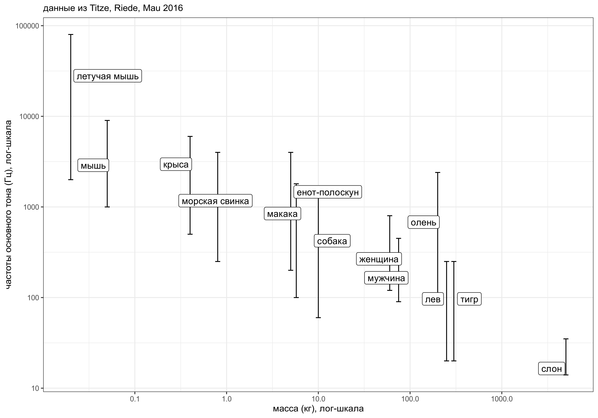

```{r setup, include=FALSE}
options(digits = 3)
knitr::opts_chunk$set(echo = FALSE, warning = FALSE, message = FALSE)
# library(qrcode)
# png(filename="images/00_qrcode.png", width = 200, height = 200)
# qrcode_gen("https://github.com/agricolamz/2020.10.21_HSE_Phonology_of_East_Caucasian_languages/raw/master/2020.10.21_HSE_Phonology_of_East_Caucasian_languages.pdf")
# dev.off()
library(tidyverse)
theme_set(theme_bw()+theme(text = element_text(size=18)))
library(phonfieldwork)
```

# Optimized Communication

## mass and frequency

```{r, eval = FALSE}
options(scipen = 999)
df <- read_csv("data/Titze I., Riede T., Mau T. 2016.csv")
set.seed(42)
df %>% 
  mutate(mid = max_f0_hz - 2*(max_f0_hz-min_f0_hz)/3) %>% 
  ggplot(aes(mass_kg, mid, label = species_ru)) +
  geom_errorbar(aes(ymin = min_f0_hz, ymax = max_f0_hz))+
  ggrepel::geom_label_repel(show.legend = FALSE)+
  scale_x_log10()+
  scale_y_log10()+
  scale_color_discrete()+
  theme_bw()+
  labs(color = "", x = "масса (кг), лог-шкала", y = "частоты основного тона (Гц), лог-шкала",
       subtitle = "данные из Titze, Riede, Mau 2016")
ggsave("images/01_mass_freq.png")
```



## But some animals use some tricks!

BBC, Earth's tropical Island -- Borneo (20:47)

# Hearing and Sound Production

## Hearing and Sound Production

* Hearing is surprisingly simmilar
* Sound production of breathing animals:
    * non-aquatic mammals
        * exhalation through valve
    * aquatic mammals
        * moving are from one reservoir to another through the oscillating valve
* Sound production of non-breathing animals:
    * muscle-driven mechanical vibrations

# Vibrational Communication

## Some animals do both!

[Владимир Динец (2015) Песни драконов](https://www.corpus.ru/products/vladimir-dinets-pesni-drakonov.htm)

# Insects
# Land Vertebrates
# Birds
# Bats
# Aquatic Animals
# Generalities

# References {.allowframebreaks}
